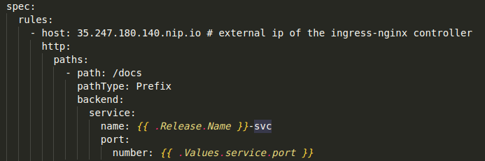
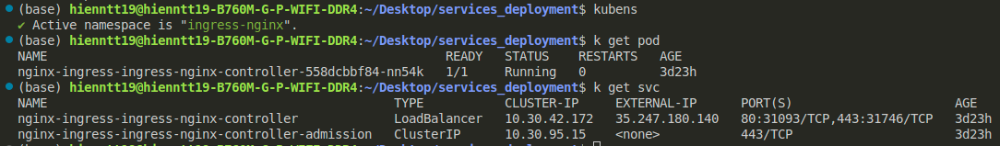
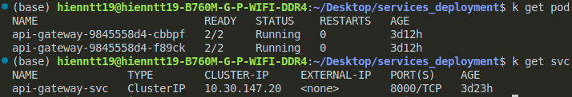
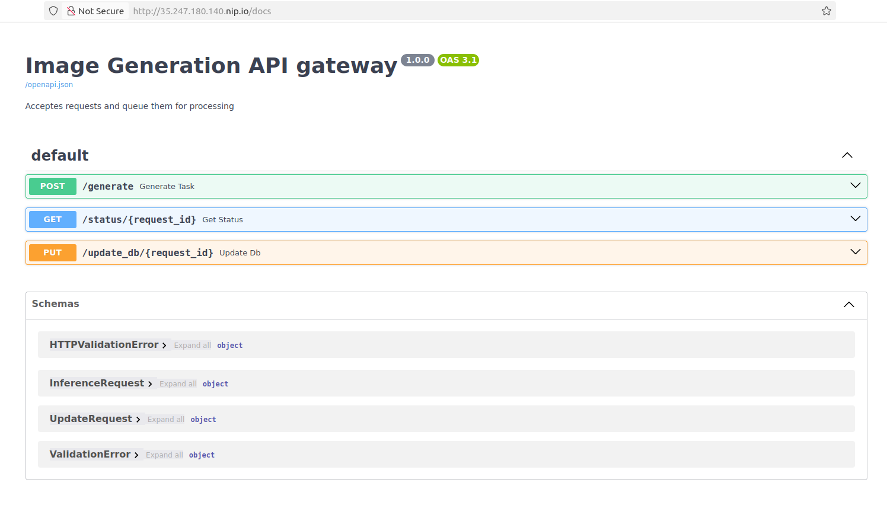
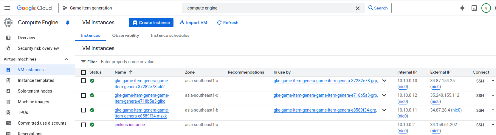
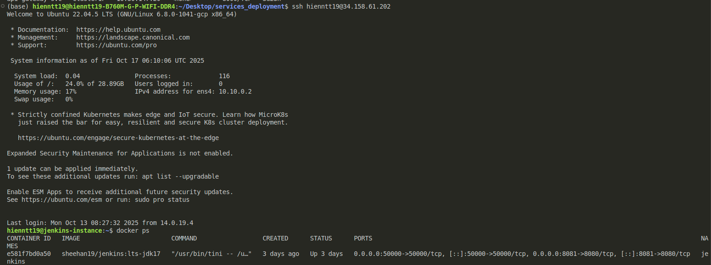
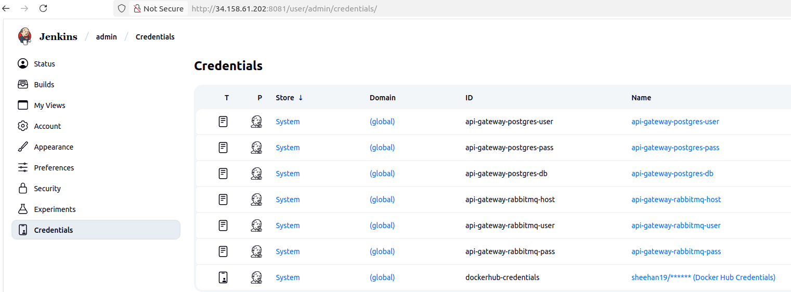
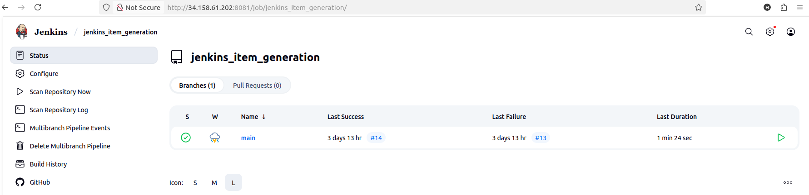

# Tsuki-Style Item Generation System - Services Deployment

## Table of content
- [Introduction](#introduction)
- [System architecture](#system-architecture)
- [Project structure](#project-structure)
- [Deployment on GCP](#deployment-on-gcp)
   1. [Provision infrastructures with Terraform](#provision-infrastructures-with-terraform)
   2. [Deploy GKE services - Ingress-nginx, API Gateway, RabbitMQ](#deploy-gke-services---ingress---nginx-api-gateway-rabbitMQ)
- [Setup CI/CD with Jenkins](#setup-ci-/--cd-with-jenkins)
- [API flow and output](#api-flow-and-output)

## Introduction
This repository contains the backend services, infrastructure code, and deployment configurations for the Tsuki-Style Item Generation System. The system is designed to generate unique game item images based on user-provided text prompts, mimicking the art style of the Tsuki Adventure game.

The entire system is built on a microservices architecture, composed of 2 main parts:

1. **GKE Cluster Services (this repository)**: Manages all backend logic, including the API Gateway for handling user requests, a message queue (RabbitMQ) for queuing job messages, and an Nginx-Ingress Controller for routing traffic. 

2. **Inference Worker ([other repository](https://github.com/hienntt19/game-item-generation.git))**: A GPU-powered VM responsible for image generation tasks. It consumes jobs from the message queue and runs the fine-tuned Stable Diffusion model. 

## System architecture
<p align="center">
  
</p>

**Main workflows:**
- **Request submission**: User sends HTTP POST request to the system's endpoint with a json payload containing the prompt and other parameters (num_inference_steps, guidance_scale, etc.).
- **Routing**: Nginx Ingress Controller routes the incoming request to the API Gateway service.
- **Job registration**: API Gateway validates the request, save the job details to Cloud SQL (PostgreSQL) database with a "Pending" status, and immediately returns a unique request_id to the user.
- **Job queuing**: Simultaneously, API Gateway pushes a message containing the request_id and all generation parameters into a RabbitMQ queue.
- **Image generation (Inference worker)**: 
   + The inference worker (running on a seperate VM) consumes messages from the queue.
   + It calls the API Gateway to update the job status to "Processing".
   + It runs the inference processing using the fine-tuned Stable Diffusion model to generate image.
   + Upon completion, it uploads the final image to Google Cloud Storage (GCS).
   + Finally, it calls the API Gateway again to update the job status to "Completed" and stores the public GCS URL of the image in the database. If an error occurs, the status is set to "Failed".


## Project structure
```
.
├── api_gateway           - Defines API Gateway logic
├── deployments           - Kubernetes manifests and helm charts
├── images                - Sample images
├── jenkins               - Docker and Docker compose file to deploy jenkins
├── postgres              - SQL script to create database on Cloud SQL
├── terraform             - Provision infrastructures for cloud deployment
├── tests                 - Unit tests for API Gateway api
├── Dockerfile            - Docker image of API Gateway
├── export_env.sh         - Exports sensitive environment variables
├── Jenkinsfile           - Defines CI/CD pipeline with jenkins
└── requirements.txt      - Python dependencies
```

## Deployment on GCP

### 1. Provision infrastructures with Terraform
Terraform offers the following infrastructures:
- GKE cluster with Node Pool configurations (to deploy Ingress-Nginx, API Gateway, RabbitMQ)
- Cloud SQL (Postgres)
- GCE (to run Jenkins)
- Service account for:
   + GKE nodes
   + API Gateway with Cloud SQL Client role and workload identity iam (to update Cloud SQL)
   + Jenkins VM with Kubernetes Engine Developer role (to deploy application to GKE cluster)
- Firewall (to allow Jenkins ports)
- VPC network and subnetwork

To setup infrastructures:
```
cd terraform/prod
terraform init
terraform plan
terraform apply
```

### 2. Deploy GKE services - Ingress-nginx, API Gateway, RabbitMQ
**Deploy Ingress-nginx:**
```
kubectl create namespace ingress-nginx
kubens ingress-nginx

helm repo add ingress-nginx https://kubernetes.github.io/ingress-nginx
helm repo update
helm install nginx-ingress ingress-nginx/ingress-nginx
```

**Deploy RabbitMQ:**
```
cd deployments

kubectl create namespace rabbitmq
kubens rabbitmq
helm upgrade --install my-prod-rabbitmq ./my-rabbitmq
```

Access RabbitMQ through web ui:
```
kubectl port-forward svc/my-prod-rabbitmq 15672:15672
```

**Deploy API Gateway and connect with Cloud SQL:**

Replace host in deployments/api_gateway/templates/ingress.yaml with ingress-nginx external IP:
<p align="center">
  
</p>
<p align="center">
  
</p>

Access to Cloud SQL, create database named *image_requests* and table  *generation_requests* with script in postgres/create_database.sql.

Replace rabbitmq host, rabbitmq user, instance_connection_name, database name, database user, database host in
deployments/api_gateway/values.yaml with your own settings.

Replace DATABASE_PASS, RABBITMQ_DEFAULT_PASS in export_env.sh with your own settings.

```
source export_env.sh

cd deployments

kubectl create namespace service-dev
kubens service-dev
helm upgrade --install api-gateway ./api_gateway
```

<p align="center">
  
</p>

Access API Gateway API using ingress host:
<p align="center">
  
</p>

## Setup CI/CD with Jenkins
Create ssh-key on local computer, add it to Jenkins VM instance and connect Jenkins VM instance through ssh:

<p align="center">
  
</p>

<p align="center">
  
</p>

```
ssh hienntt19@34.158.61.202
```

After accessing to Jenkins VM instance, create jenkins folder containing Dockerfile and docker-compose.yaml 
with the same content as jenkins/ :

```
mkdir jenkins

cd jenkins

vim Dockerfile # then paste content to it
vim docker-compose-jenkins.yaml # then paste content to it

```

Run Jenkins docker container:
```
docker compose -f docker-compose-jenkins.yaml up
```
<p align="center">
   
</p>

Save Jenkins password to .env file.

Access Jenkins UI through ```34.158.61.202:8081```:
   - Install suggested packages and Kubernetes plugin.
   - Create New item, add the following credentials and config with Github repository, replace Jenkins files configurations.
   <p align="center">
      
   </p>

CI/CD results:
<p align="center">
   
</p>

## API flow and output
