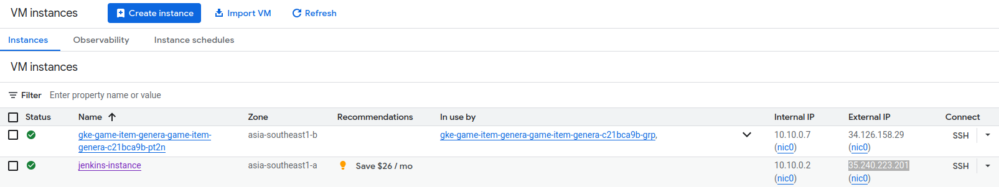

# Tsuki-Style Item Generation System - Services Deployment
This repository contains the backend services, infrastructure as code, and deployment configurations for the Tsuki-Style Item Generation System. The system is designed to generate unique game item images based on user-provided text prompts, mimicking the art style of the Tsuki Adventure game.

## Table of content
- [1. Introduction](#1-introduction)
- [2. System Architecture](#2-system-architecture)
- [3. Project structure](#3-project-structure)
- [4. Deployment on GCP](#4-deployment-on-gcp)
  - [4.1. Provision infrastructures with Terraform](#4-1-provision-infrastructures-with-terraform)
  - [4.2. Deploy GKE services - Ingress-nginx, API Gateway, RabbitMQ](#4-2-deploy-gke-services---ingress---nginx-api-gateway-rabbitMQ)
- [5. Setup CI/CD with Jenkins](#5-setup-ci-/--cd-with-jenkins)
- [6. API flow and output](#api-flow-and-output)
- [7. Monitoring setup](#7-monitoring-setup)
  - [7.1. Setup ELK stack](#7-1-setup-elk-stack)
  - [7.2. Setup Jaeger for distributed tracing](#7-2-setup-jaeger-for-distributed-tracing)
  - [7.3. Setup Prometheus and Grafana stack](#7-3-setup-prometheus-and-grafana-stack)


## 1. Introduction

The system is built on a microservices architecture and consists of 2 main parts:

1. **GKE Cluster Services (this repository)**: Manages all backend logic, including an API Gateway for handling user requests, a message queue (RabbitMQ) for queuing job messages, and an Nginx-Ingress Controller for routing traffic. 

2. **Inference Worker ([other repository](https://github.com/hienntt19/game-item-generation.git))**: A GPU-powered VM responsible for image generation tasks. It consumes jobs from the message queue and runs the fine-tuned Stable Diffusion model. 

## 2. System Architecture
<p align="center">
  
</p>

### Main workflows
1. **Request submission**: User sends HTTP POST request to the system's endpoint with a json payload containing the prompt and other parameters (num_inference_steps, guidance_scale, etc.).
2. **Routing**: Nginx Ingress Controller routes the incoming request to the API Gateway service.
3. **Job registration**: API Gateway validates the request, save the job details to Cloud SQL (PostgreSQL) database with a "Pending" status, and immediately returns a unique request_id to the user.
4. **Job queuing**: Simultaneously, API Gateway pushes a message containing the request_id and all generation parameters into a RabbitMQ queue.
5. **Image generation (Inference worker)**: 
   - The inference worker (running on a seperate VM) consumes messages from the queue.
   - It calls the API Gateway to update the job status to "Processing".
   - It runs the inference processing using the fine-tuned Stable Diffusion model to generate image.
   - Upon completion, it uploads the final image to Google Cloud Storage (GCS).
   - Finally, it calls the API Gateway again to update the job status to "Completed" and stores the public GCS URL of the image in the database. If an error occurs, the status is set to "Failed".


## 3. Project structure
```
.
├── api_gateway           - Defines API Gateway logic
├── deployments           - Kubernetes manifests and helm charts
├── images                - Sample images
├── jenkins               - Docker and Docker compose file to deploy jenkins
├── postgres              - SQL script to create database on Cloud SQL
├── terraform             - Provision infrastructures for cloud deployment
├── tests                 - Unit tests for API Gateway api
├── Dockerfile            - Docker image of API Gateway
├── export_env.sh         - Exports sensitive environment variables
├── Jenkinsfile           - Defines CI/CD pipeline with jenkins
└── requirements.txt      - Python dependencies
```

## 4. Deployment on GCP
**Prerequisites:**
- Google Cloud SDK installed and configured

**Authentication:**
- Authenticate local environment with gcloud

  ```
  gcloud auth login
  gcloud config set project YOUR_PROJECT_ID
  ```

### 4.1. Provision infrastructures with Terraform
This Terraform setup will provision the following resources: 
- A GKE cluster with a configured Node Pool
- A Cloud SQL (PostgresSQL) instance with the required database and table
- A GCE instance to host Jenkins
- A GCS bucket to store generated images
- Service Accounts with appropriate IAM roles for GKE, API Gateway, Jenkins and GCS
- VPC network, subnetwork anf firewall rules

To apply the infrastructures:

```
cd terraform
terraform init
terraform plan
terraform apply
```

To retrieve Cloud SQL password after deployment, run:
```
terraform output db_password
```

### 4.2. Deploy GKE services - Ingress-nginx, API Gateway, RabbitMQ
**First, connect to new GKE cluster:**

```
gcloud container clusters get-credentials game-item-generation-service-cluster --region asia-southeast1 --project game-item-generation
```

**Create namespaces:**

```
kubectl create namespace service-dev
kubectl create namespace monitor
kubectl create namespace nginx-ingress
```

**Create Kubernetes secrets:**
```
cd deployments
kubectl apply -f secrets.yaml
```

**Deploy Ingress-Nginx:**
```
helm upgrade --install ingress-nginx ./ingress-nginx/ --namespace nginx-ingress
```

After deployment, retrieve the external IP address of the Ingress controller and update the host in api_gateway/templates/ingress.yaml accordingly:

  <p align="center">
    
  </p>

  <p align="center">
    
  </p>


**Deploy RabbitMQ:**

```
helm upgrade --install rabbitmq ./rabbitmq --namespace service-dev
```

To access the RabbitMQ management UI locally, forward the port:
```
kubectl port-forward svc/rabbitmq 15672:15672 -n service-dev
```

**Deploy API Gateway:**

```
helm upgrade --install api-gateway ./api_gateway --namespace service-dev
```

Access API Gateway API using ingress host:
<p align="center">
  
</p>

## 5. Setup CI/CD with Jenkins
1. **SSH into the Jenkins VM:** Create an ssh-key pair on local computer and add the public key to Jenkins VM instance on GCP. Connect to the instance via ssh:

  <p align="center">
    
  </p>

  <p align="center">
    
  </p>

  ```
  ssh hienntt19@35.240.223.201
  ```

2. **Install Docker on VM instance:** Follow the official documentation https://docs.docker.com/engine/install/ubuntu/

3. **Deploy Jenkins:**
- Inside the VM, create a `jenkins` directory and copy the `Dockerfile` and `docker-compose-jenkins.yaml` from the `jenkins/` directory of this repository.
  ```
  mkdir jenkins

  cd jenkins

  vim Dockerfile # then paste content to it
  vim docker-compose-jenkins.yaml # then paste content to it

  ```

- Run the Jenkins container:

  ```
  docker compose -f docker-compose-jenkins.yaml up -d
  ```
  <p align="center">
    
  </p>

  Save Jenkins password to .env file

4. **Initial Jenkins Setup:**

- Access Jenkins UI at `http://<YOUR_JENKINS_VM_IP>:8081`
- Login with jenkins username and password:
    <p align="center">
      
    </p>
- Install suggested plugins:
    <p align="center">
      
    </p>

    <p align="center">
      
    </p>

    <p align="center">
      
    </p>

5. **Configure Jenkins Plugins:**
- After the initial setup, navigate to **Manage Jenkins > Plugins** and install the Docker, DockerPipeline, and Kubernetes plugins:
  <p align="center">
    
  </p>

6. **Create Jenkins Pipeline:**
- Create a New item in Jenkins:
  <p align="center">
    
  </p>

- Configure the pipeline to use the `Jenkinsfile` from Github repository:
  <p align="center">
    
  </p>

7. **Add Credentials:**
  - Go to **Manage Jenkins > Credentials** and add the following credentials:
    + **Secret text** for database and RabbitMQ connection details:
    + **Username with password** for Dockerhub credentials

      <p align="center">
        
      </p>

8. **Setup Github Webhook:**
- In Github repository setting, navigate to **Webhooks** and create a new webhook pointing to Jenkins server to trigger builds on push events
  <p align="center">
    
  </p>

## 6. API flow and output


## 7. Monitoring Setup

### 7.1. Setup ELK stack

**Install Cert-Manager:**
```
helm repo add jetstack https://charts.jetstack.io
helm repo update

helm install \
  cert-manager jetstack/cert-manager \
  --namespace cert-manager \
  --create-namespace \
  --version v1.13.2 \
  --set installCRDs=true
```

**Install ClusterIssuers:**
```
kubectl apply -f letsencrypt-issuer.yaml
```

**Config GCP Firewall**
- Find all nodes in GKE cluster and assign `gke-ingress-node` tag:
```
gcloud compute instances add-tags gke-game-item-genera-game-item-genera-056fe755-9flr --tags=gke-ingress-node --zone=asia-southeast1-b

```

- Create Firewall rule:
```
gcloud compute firewall-rules create allow-vast-ai-to-es \
    --network=<YOUR_VPC_NETWORK_NAME> \
    --action=ALLOW \
    --direction=INGRESS \
    --rules=tcp:443 \
    --source-ranges=<YOUR_VAST_AI_VM_IP>/32 \
    --target-tags=gke-ingress-node \
    --description="Allow Filebeat from vast.ai VM to reach Elasticsearch Ingress"
```


**Deploy Elasticsearch:**
```
helm upgrade --install elasticsearch ./elasticsearch/ -f ./elasticsearch/values.yaml -n monitor
```

**Deploy Filebeat:**
```
helm upgrade --install filebeat ./filebeat/ -f ./filebeat/values.yaml -n monitor
```

**Deploy Kibana:**
```
helm upgrade --install kibana ./kibana/ -f ./kibana/values.yaml -n monitor
```

Access Kibana UI with port-forward:
```
kubectl port-forward svc/kibana-kibana 5601:5601
```


### 7.2. Setup Jaeger for distributed tracing
**Setup ca-cert:**
```
kubectl get secret elasticsearch-master-certs -n monitor -o yaml

# Copy ca.crt and decode:
echo "..." | base64 --decode > es-ca.crt

# Create new secret:
kubectl create secret generic jaeger-es-ca --from-file=es-ca.crt -n monitor
```

**Expose Jaeger collector with LoadBalancer**

**Deploy Jaeger:**
```
helm upgrade --install jaeger ./jaeger -n monitor
```

Access Jaeger UI locally by port-forward:
```
kubectl port-forward -n monitor svc/jaeger-query 16686:80
```


### 7.3. Setup Prometheus and Grafana stack
**Install Prometheus stack:**
```
cd kube-prometheus-stack
helm dependency update

cd ..
helm upgrade --install prometheus-stack ./kube-prometheus-stack/ -n monitor
```

Get Grafana admin password:
```
kubectl get secret -n monitor prometheus-stack-grafana -o jsonpath="{.data.admin-password}" | base64 --decode ; echo
```

Access Grafana UI at `grafana.34.142.131.209.nip.io`

Apply Service monitor for Api Gateway and Alert manager with discord:
```
kubectl apply -f api-gateway-servicemonitor.yaml
kubectl apply -f discord-bridge.yaml
kubectl apply -f allow-gateway-to-jaeger.yaml 
```


