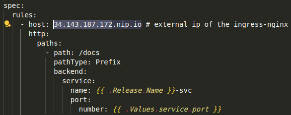

# Tsuki-Style Item Generation System - Services Deployment

## Table of content
- [Introduction](#introduction)
- [System architecture](#system-architecture)
- [Project structure](#project-structure)
- [Deployment on GCP](#deployment-on-gcp)
   1. [Provision infrastructures with Terraform](#provision-infrastructures-with-terraform)
   2. [Deploy GKE services - Ingress-nginx, API Gateway, RabbitMQ](#deploy-gke-services---ingress---nginx-api-gateway-rabbitMQ)
- [Setup CI/CD with Jenkins](#setup-ci-/--cd-with-jenkins)
- [API flow and output](#api-flow-and-output)

## Introduction
This repository contains the backend services, infrastructure code, and deployment configurations for the Tsuki-Style Item Generation System. The system is designed to generate unique game item images based on user-provided text prompts, mimicking the art style of the Tsuki Adventure game.

The entire system is built on a microservices architecture, composed of 2 main parts:

1. **GKE Cluster Services (this repository)**: Manages all backend logic, including the API Gateway for handling user requests, a message queue (RabbitMQ) for queuing job messages, and an Nginx-Ingress Controller for routing traffic. 

2. **Inference Worker ([other repository](https://github.com/hienntt19/game-item-generation.git))**: A GPU-powered VM responsible for image generation tasks. It consumes jobs from the message queue and runs the fine-tuned Stable Diffusion model. 

## System architecture
<p align="center">
  
</p>

**Main workflows:**
- **Request submission**: User sends HTTP POST request to the system's endpoint with a json payload containing the prompt and other parameters (num_inference_steps, guidance_scale, etc.).
- **Routing**: Nginx Ingress Controller routes the incoming request to the API Gateway service.
- **Job registration**: API Gateway validates the request, save the job details to Cloud SQL (PostgreSQL) database with a "Pending" status, and immediately returns a unique request_id to the user.
- **Job queuing**: Simultaneously, API Gateway pushes a message containing the request_id and all generation parameters into a RabbitMQ queue.
- **Image generation (Inference worker)**: 
   + The inference worker (running on a seperate VM) consumes messages from the queue.
   + It calls the API Gateway to update the job status to "Processing".
   + It runs the inference processing using the fine-tuned Stable Diffusion model to generate image.
   + Upon completion, it uploads the final image to Google Cloud Storage (GCS).
   + Finally, it calls the API Gateway again to update the job status to "Completed" and stores the public GCS URL of the image in the database. If an error occurs, the status is set to "Failed".


## Project structure
```
.
├── api_gateway           - Defines API Gateway logic
├── deployments           - Kubernetes manifests and helm charts
├── images                - Sample images
├── jenkins               - Docker and Docker compose file to deploy jenkins
├── postgres              - SQL script to create database on Cloud SQL
├── terraform             - Provision infrastructures for cloud deployment
├── tests                 - Unit tests for API Gateway api
├── Dockerfile            - Docker image of API Gateway
├── export_env.sh         - Exports sensitive environment variables
├── Jenkinsfile           - Defines CI/CD pipeline with jenkins
└── requirements.txt      - Python dependencies
```

## Deployment on GCP
Prequisite: Google Cloud SDK installed

**Authenticate with gcloud: ***

```
gcloud auth login
gcloud config set project YOUR_PROJECT_ID

```

### 1. Provision infrastructures with Terraform
Terraform offers the following infrastructures:
- GKE cluster with Node Pool configurations (to deploy Ingress-Nginx, API Gateway, RabbitMQ)
- Cloud SQL (Postgres) and required database, table
- GCE (to run Jenkins)
- GCS (to store generated images by inference worker)
- Service account for:
   + GKE nodes
   + API Gateway with Cloud SQL Client role and workload identity iam (to update Cloud SQL)
   + Jenkins VM with Kubernetes Engine Developer role (to deploy application to GKE cluster)
   + GCS with Object Storage Admin role
- Firewall (to allow Jenkins ports)
- VPC network and subnetwork

To setup infrastructures:
```
cd terraform
terraform init
terraform plan
terraform apply
```

Show Cloud SQL account password:
```
terraform output db_password
```

### 2. Deploy GKE services - Ingress-nginx, API Gateway, RabbitMQ
**Connect with GKE cluster:**
```
gcloud container clusters get-credentials game-item-generation-service-cluster --region asia-southeast1 --project game-item-generation
```

**Create namespace:**
```
kubectl create namespace service-dev
kubectl create namespace monitor
kubectl create namespace nginx-ingress
```

**Create secrets:**
```
cd deployments
kubectl apply -f secrets.yaml
```

**Deploy Ingress-nginx:**
```
helm upgrade --install ingress-nginx ./ingress-nginx/ --namespace nginx-ingress
```

**Show nginx-ingress External IP and put it in api_gateway/templates/ingress.yaml host:**
<p align="center">
  
</p>

<p align="center">
  
</p>


**Deploy RabbitMQ:**
```
helm upgrade --install rabbitmq ./rabbitmq --namespace service-dev
```

Access RabbitMQ through web ui:
```
kubectl port-forward svc/rabbitmq 15672:15672 -n service-dev
```

**Deploy API Gateway:**
```
helm upgrade --install api-gateway ./api_gateway --namespace service-dev
```

Access API Gateway API using ingress host:
<p align="center">
  
</p>

## Setup CI/CD with Jenkins
Create ssh-key on local computer, add it to Jenkins VM instance and connect Jenkins VM instance through ssh:

<p align="center">
  
</p>

<p align="center">
  
</p>

```
ssh hienntt19@35.240.223.201
```

Install Docker on VM instance: https://docs.docker.com/engine/install/ubuntu/

After accessing to Jenkins VM instance, create jenkins folder containing Dockerfile and docker-compose.yaml 
with the same content as jenkins/ :

```
mkdir jenkins

cd jenkins

vim Dockerfile # then paste content to it
vim docker-compose-jenkins.yaml # then paste content to it

```

Run Jenkins docker container:
```
docker compose -f docker-compose-jenkins.yaml up
```
<p align="center">
   
</p>

Save Jenkins password to .env file.

Access Jenkins UI through ```35.240.223.201:8081```:
  - Login with jenkins password:
      <p align="center">
        
      </p>

  - Install suggested plugins:
      <p align="center">
        
      </p>

      <p align="center">
        
      </p>

      <p align="center">
        
      </p>

  - After successfully login to Jenkins, install Docker, DockerPipeline, Kubernetes plugins:
      <p align="center">
        
      </p>

  - Restart and login into Jenkins again

  - Create New item:
    <p align="center">
      
    </p>

  - Config New item with Github URL and credentials:
    <p align="center">
      
    </p>

  - Go to Manage Jenkins/Credentials and add the following credentials:
    + Add global Credentials with kind Secret text for:
        api-gateway-postgres-user,
        api-gateway-postgres-pass,
        api-gateway-postgres-db,
        api-gateway-rabbitmq-host,
        api-gateway-rabbitmq-user,
        api-gateway-rabbitmq-pass

      <p align="center">
        
      </p>

    + Add global Credentials with kind Username with password for dockerhub-credentials:

      <p align="center">
        
      </p>

    <p align="center">
      
    </p>

  - Create Github webhook to trigger Jenkins CI/CD
    + Go to Github repository of the project -> Webhooks -> Add webhook
      <p align="center">
        
      </p>

## API flow and output


## Monitoring setup

### Install ELK

```
# Elasticsearch
helm upgrade --install elasticsearch ./elasticsearch/ -f ./elasticsearch/values.yaml -n monitor

# Kibana
helm upgrade --install kibana ./kibana/ -f ./kibana/values.yaml -n monitor
# Access kibana
kubectl port-forward svc/kibana-kibana 5601:5601

# Install filebeat
helm upgrade --install filebeat ./filebeat/ -f ./filebeat/values.yaml -n monitor

# Install Jaeger
helm repo add jetstack https://charts.jetstack.io
helm repo update

helm install \
  cert-manager jetstack/cert-manager \
  --namespace cert-manager \
  --create-namespace \
  --version v1.13.2 \
  --set installCRDs=true

helm upgrade --install jaeger ./jaeger -n monitor

# Cert
kubectl get secret elasticsearch-master-certs -n monitor -o yaml

Copy ca.crt and decode:
echo "..." | base64 --decode > es-ca.crt

Create new secret:
kubectl create secret generic jaeger-es-ca --from-file=es-ca.crt -n monitor


# Access Jaeger UI
kubectl port-forward -n monitor svc/jaeger-query 16686:80

# Install Prometheus stack
cd kube-prometheus-stack
helm dependency update

cd ..
helm upgrade --install prometheus-stack ./kube-prometheus-stack/ -n monitor

Get Grafana password:
kubectl get secret -n monitor prometheus-stack-grafana -o jsonpath="{.data.admin-password}" | base64 --decode ; echo


kubectl apply -f api-gateway-servicemonitor.yaml
kubectl apply -f discord-bridge.yaml

Access Grafana UI: ```grafana.34.143.187.172.nip.io```

```


